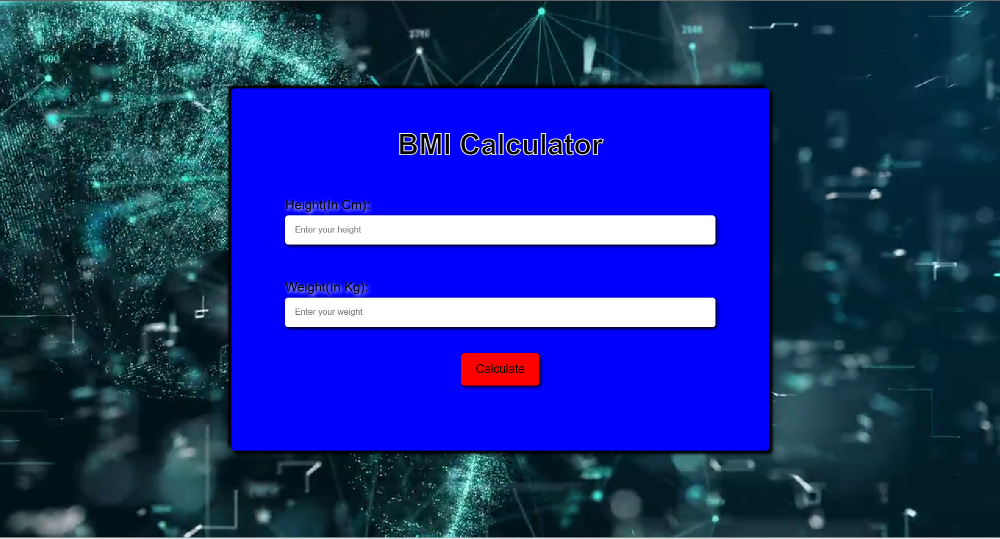
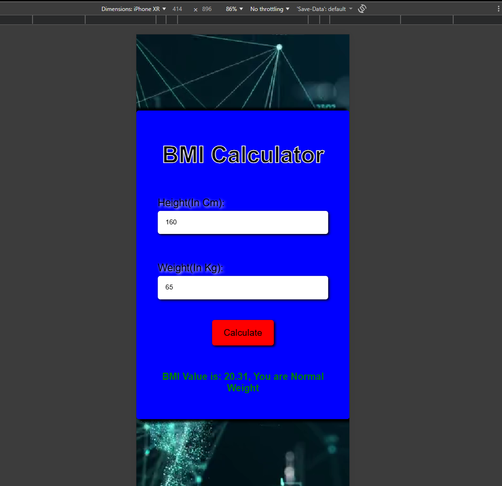

# BMI Calculator App

A simple BMI Calculator made using HTML, CSS and JavaScript.

## Features
- User can enter height and weight
- Calculates BMI instantly
- Shows BMI category
- Simple and clean UI

## Technologies Used
- HTML
- CSS
- JavaScript

## Live Demo
https://shubham-code05.github.io/bmi-calculator-app/

## Screenshots

### Home Page

### BMI Result

### Mobile View

